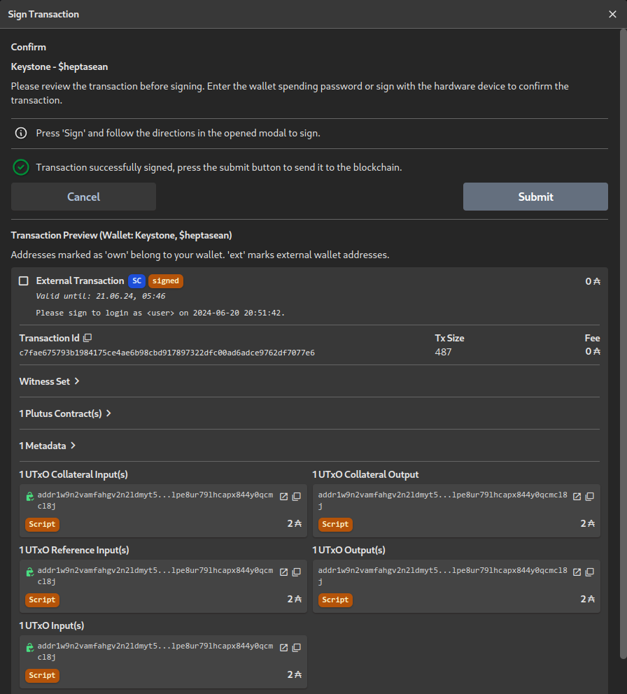

# The Most Trivial Aiken Validators
This very tiny toy project implements the two most trivial Cardano
validators in Aiken – one that always succeeds, lets everyone execute a
transaction without any restrictions, and one that always fails, lets
nobody execute a transaction and locks assets forever, “burns” them.

Aiken's homepage is [https://aiken-lang.org/](https://aiken-lang.org/)
which also contains a lot of good “getting started” documentation and the
standard library (which we do not even have to use in these trivial
examples) is documented at
[https://aiken-lang.github.io/stdlib/](https://aiken-lang.github.io/stdlib/).

After starting a new project with `aiken new heptasean/aiken-trivial`, I have
implemented these validators in `validators/trivial.ak`.
The source code are just 19 lines – including equally trivial test cases for
both of them:
```gleam
validator {
  fn always_succeeds(_datum: Data, _redeemer: Data, _context: Data) -> Bool {
    True
  }
}

test succeeds() {
  always_succeeds(Void, Void, Void)
}

validator {
  fn always_fails(_datum: Data, _redeemer: Data, _context: Data) -> Bool {
    False
  }
}

test fails() fail {
  always_fails(Void, Void, Void)
}
```

## Testing and Building
To run the tests (and generally check everything else is okay), we can use
`aiken check`:
```shellsession
$ aiken check
    Compiling hepta/trivial 1.0.0 (/home/sean/Cardano/Repos/aiken-trivial)
      Testing ...

    ┍━ trivial ━━━━━━━━━━━━━━━━━━━━━━━━━━━
    │ PASS [mem: 200, cpu: 23100] succeeds
    │ PASS [mem: 200, cpu: 23100] fails
    ┕━━━━━━━ 2 tests | 2 passed | 0 failed

      Summary 2 checks, 0 errors, 0 warnings
```

And then `aiken build` can be used to actually build the validators:
```shellsession
$ aiken build
    Compiling hepta/trivial 1.0.0 (/home/sean/Cardano/Repos/aiken-trivial)
   Generating project's blueprint (/home/sean/Cardano/Repos/aiken-trivial/plutus.json)
      Summary 0 errors, 0 warnings
```

The main result of this is the blueprint JSON file `plutus.json` containing
the compiled bytecode, the hashes, and some metadata about our two
validators.

## Addresses and Plutus Files
We can use `aiken address` to get the addresses for these validators:
```shellsession
$ aiken address --validator trivial.always_succeeds
addr_test1wquu2gxsvfa2lfeg7ljd6yq59dmuy4up8sm02l3vhz8h9fg4q3ckq
      Summary 0 errors, 0 warnings
$ aiken address --validator trivial.always_succeeds --mainnet
addr1wyuu2gxsvfa2lfeg7ljd6yq59dmuy4up8sm02l3vhz8h9fgwg9ye9
      Summary 0 errors, 0 warnings
$ aiken address --validator trivial.always_fails
addr_test1wpn2vamfahgv2n2ldmyt5wf9899lpe8ur79lhcapx844y0qrnvrgh
      Summary 0 errors, 0 warnings
$ aiken address --validator trivial.always_fails --mainnet
addr1w9n2vamfahgv2n2ldmyt5wf9899lpe8ur79lhcapx844y0qcmcl8j
      Summary 0 errors, 0 warnings
```

As it turns out when checking on an explorer, both of them have been used
before on all of the networks:
| Validator         | Mainnet | Preprod | Preview |
| ----------------- | ------- | ------- | ------- |
| `always_succeeds` | [addr1wyu…wg9ye9](https://beta.explorer.cardano.org/en/address/addr1wyuu2gxsvfa2lfeg7ljd6yq59dmuy4up8sm02l3vhz8h9fgwg9ye9) | [addr_test1wqu…4q3ckq](https://preprod.beta.explorer.cardano.org/en/address/addr_test1wquu2gxsvfa2lfeg7ljd6yq59dmuy4up8sm02l3vhz8h9fg4q3ckq) | [addr_test1wqu…4q3ckq](https://preview.beta.explorer.cardano.org/en/address/addr_test1wquu2gxsvfa2lfeg7ljd6yq59dmuy4up8sm02l3vhz8h9fg4q3ckq) |
| `always_fails`    | [addr1w9n…cmcl8j](https://beta.explorer.cardano.org/en/address/addr1w9n2vamfahgv2n2ldmyt5wf9899lpe8ur79lhcapx844y0qcmcl8j) | [addr_test1wpn…rnvrgh](https://preprod.beta.explorer.cardano.org/en/address/addr_test1wpn2vamfahgv2n2ldmyt5wf9899lpe8ur79lhcapx844y0qrnvrgh) | [addr_test1wpn…rnvrgh](https://preview.beta.explorer.cardano.org/en/address/addr_test1wpn2vamfahgv2n2ldmyt5wf9899lpe8ur79lhcapx844y0qrnvrgh) |

In order to use these validators with `cardano-cli`, we need them in the
file format used by that. We can get it through `aiken blueprint convert`:
```shellsession
$ aiken blueprint convert --validator trivial.always_succeeds
{
  "type": "PlutusScriptV2",
  "description": "Generated by Aiken",
  "cborHex": "52510100003222253330044a229309b2b2b9a1"
}
$ aiken blueprint convert --validator trivial.always_fails
{
  "type": "PlutusScriptV2",
  "description": "Generated by Aiken",
  "cborHex": "52510100003222253330044a029309b2b2b9a1"
}
```

The results are committed into the repository as `always_succeeds.V1.plutus`
and `always_fails.V1.plutus`. (`V1` since we want to keep all validators
that have ever been used available even if new versions are published –
although the chances for a new version are rather low with these
specifically.)

## Excursion: Other Always Fail Burn Scripts and Addresses
Since a lot of projects want to prove to their users that they have “burnt”
(or rather locked forever) some tokens and since an always failing script
is one of the obvious toy examples, there are some other scripts/addresses
with a similar purpose.

The `cardano-node` Github repository itself contains a
[V1 always-fails.plutus](https://github.com/IntersectMBO/cardano-node/blob/master/scripts/plutus/scripts/v1/always-fails.plutus)
and a
[V2 always-fails.plutus](https://github.com/IntersectMBO/cardano-node/blob/master/scripts/plutus/scripts/v2/always-fails.plutus)
example.

The addresses for these can be found with `cardano-cli` (we could have also
used it for our examples with the same results that `aiken address` gave
us):
```shellsession
$ cardano-cli address build --payment-script-file always-fails.V1.plutus --mainnet; echo
addr1w8qvvu0m5jpkgxn3hwfd829hc5kfp0cuq83tsvgk44752dsea0svn
$ cardano-cli address build --payment-script-file always-fails.V2.plutus --mainnet; echo
addr1w9gexmeunzsykesf42d4eqet5yvzeap6trjnflxqtkcf66g5740fw
```

Both have been used on mainnet quite a lot:
[addr1w8q…ea0svn](https://beta.explorer.cardano.org/en/address/addr1w8qvvu0m5jpkgxn3hwfd829hc5kfp0cuq83tsvgk44752dsea0svn),
[addr1w9g…5740fw](https://beta.explorer.cardano.org/en/address/addr1w9gexmeunzsykesf42d4eqet5yvzeap6trjnflxqtkcf66g5740fw)

Another possibility to achieve this, is to use a simple native script with
an empty `any` requirement:
```shellsession
$ cat false.json
{
    "type": "any",
    "scripts": []
}
$ cardano-cli address build --payment-script-file false.json --mainnet; echo
addr1w9fdc02rkmfyvh5kzzwwwk4kr2l9a8qa3g7feehl3ga022qz2249g
```

This has not been used much:
[addr1w9f…z2249g](https://beta.explorer.cardano.org/en/address/addr1w9fdc02rkmfyvh5kzzwwwk4kr2l9a8qa3g7feehl3ga022qz2249g)
The only ADA on there is one that I put there to test.
But the nice thing about this is that Cardanoscan allows to “verify” native
scripts so that users can see there that this is, in fact, a “burn” address
and assets here are surely locked forever:
[addr1w9f…z2249g on Cardanoscan](https://cardanoscan.io/address/7152dc3d43b6d2465e96109ce75ab61abe5e9c1d8a3c9ce6ff8a3af528?tab=script)

Not using a Plutus or native script at all, another possibility for a
“burn” address is using the address for an all-zero payment key hash.
Since it is incredibly unlikely that anyone ever finds a public key whose
hash is all zeroes, this is also a “burn” address for all intents and
purposes:
[addr1vyq…kdl5mw](https://beta.explorer.cardano.org/en/address/addr1vyqqqqqqqqqqqqqqqqqqqqqqqqqqqqqqqqqqqqqqqqqqqqqkdl5mw)
There is also a variant (which hasn't been used), where the stake part of
the address is also all zeroes:
[addr1qyq…v2t5am](https://cardanoscan.io/address/010000000000000000000000000000000000000000000000000000000000000000000000000000000000000000000000000000000000000000)
(on Cardanoscan, because the cardano.org explorer does not support unused
addresses at the moment)

In fact, all of the above addresses could be combined with arbitrary stake
parts of existing or non-existing stake keys.
If the stake key exists, it has the ADA in these locked addresses on its
stake forever.
So, to get an overview of all assets that are locked forever on Cardano, we
would not only have to look for still other implementations of “always
fails” scripts (other implementations in Plutus, native scripts with
`before` in the past, …), but also search for all addresses that combine
these as payment part with arbitrary stake parts.

Finally, at the moment, Plutus scripts can only spend a UTxO if there is a
datum attached to it.
So, UTxOs without a datum on the address of a Plutus script could also be
considered “burnt”.
This mostly happens by accident and not on purpose right now, though.
And it's not easily verifiable if such UTxOs are really locked, since
native and Plutus scripts use the same type of addresses and native scripts
*can* spend UTxOs without datum.
Moreover, there are some discussions if there is a way to get those
accidentally locked assets back.

## Using the Validators with `cardano-cli`
We want to use these validators as spending validators to spend assets from
UTxOs on their addresses.
In order to be able to do that, we first have to put assets on these
addresses.
As good citizens of Cardano (and to not spend ADA that are actually worth
anything), we use the Preprod testnet for this.

We first put 5 ADA on the `always_succeeds` address with a datum `"Datum"`
put in the transaction output as a hash:
```shellsession
$ cardano-cli transaction build --testnet-magic 1 \
> --tx-in 7cba3a25ba58bd7352a1554196d73c2beb1d6cd213fad587e79f5d5312d9b8c9#0 \
> --tx-out addr_test1wquu2gxsvfa2lfeg7ljd6yq59dmuy4up8sm02l3vhz8h9fg4q3ckq+5000000 \
> --tx-out-datum-hash-value '"Datum"' \
> --change-address addr_test1qrfgal6mmwdllxdvft28xy6x3wjgc3v6nj450smmhtdama6wlu8vnqcstwtxa4l3yuckm8gttva66skvfzrmruead0ys3tkmlt \
> --out-file /tmp/fund_succeed_1.json
```
After signing and submitting this transaction we can see it
[on chain](https://preprod.beta.explorer.cardano.org/en/transaction/d94ec1de08a5bf070473ada78833cea39a6ece98d0a48e6fb208c08268fd2bd7).
[On Cardanoscan](https://preprod.cardanoscan.io/transaction/d94ec1de08a5bf070473ada78833cea39a6ece98d0a48e6fb208c08268fd2bd7?tab=utxo),
it even tells us that the first output is to a script and that it contains
a datum hash (if you click on the icon after the address).

(I'm not showing signing and submitting the transactions here and in the
remainder of the article.
What to do exactly varies depending on if you are using `cardano-cli`'s
`.skey` files, a hardware wallet and `cardano-hw-cli`, or – as I have done
for this – a wallet that is set up in Eternl and then import the
transaction and sign and submit it from there.)

To spend this UTxO again, we need to provide `cardano-cli` with the script,
the datum, and a redeemer.
Moreover, a collateral input has to be given which will be used to pay the
network in case the execution fails:
```shellsession
$ cardano-cli transaction build --testnet-magic 1 \
> --tx-in d94ec1de08a5bf070473ada78833cea39a6ece98d0a48e6fb208c08268fd2bd7#0 \
> --tx-in-script-file always_succeeds.V1.plutus \
> --tx-in-datum-value '"Datum"' --tx-in-redeemer-value '"Spend"' \
> --change-address addr_test1qrfgal6mmwdllxdvft28xy6x3wjgc3v6nj450smmhtdama6wlu8vnqcstwtxa4l3yuckm8gttva66skvfzrmruead0ys3tkmlt \
> --tx-in-collateral 6fa4f7cc6674a00395e1ca68854d47f086e3a408e2b31f75fb10a712494fc462#3 \
> --out-file /tmp/spend_succeed_1.json
```
Also, this spending transaction can be seen
[on chain](https://preprod.beta.explorer.cardano.org/en/transaction/74cec7379d2950b30252b7c683742b74cd42df704244ea8f75d5af7fb4c0ad41).

In order to not have to transmit the datum to the person or entity who
wants to spend the UTxO in some off-chain side channel, we can also tell
`cardano-cli` to embed the datum in the transaction's witness set:
```shellsession
$ cardano-cli transaction build --testnet-magic 1 \
> --tx-in d94ec1de08a5bf070473ada78833cea39a6ece98d0a48e6fb208c08268fd2bd7#1 \
> --tx-out addr_test1wquu2gxsvfa2lfeg7ljd6yq59dmuy4up8sm02l3vhz8h9fg4q3ckq+5000000 \
> --tx-out-datum-embed-value '"Datum"' \
> --change-address addr_test1qrfgal6mmwdllxdvft28xy6x3wjgc3v6nj450smmhtdama6wlu8vnqcstwtxa4l3yuckm8gttva66skvfzrmruead0ys3tkmlt \
> --out-file /tmp/fund_succeed_2.json
```
[On chain](https://preprod.beta.explorer.cardano.org/en/transaction/e0353625f3290dad3143ac17942bc440b12a1bc3c025c605f80406f0ecec8efe)
the transaction looks very similar to the first one.
The difference is that the datum is now embedded and, e.g.,
[on Cardanoscan](https://preprod.cardanoscan.io/transaction/e0353625f3290dad3143ac17942bc440b12a1bc3c025c605f80406f0ecec8efe?tab=utxo)
we can see what the datum actually is right away (when clicking on the
datum button), while that information was empty in the first example.

For the spending transaction, we still have to give the datum explicitly.
A spending application has to inspect the blockchain in search for the
embedded datum information itself and then provide it, just like in the
first example:
```shellsession
$ cardano-cli transaction build --testnet-magic 1 \
> --tx-in e0353625f3290dad3143ac17942bc440b12a1bc3c025c605f80406f0ecec8efe#0 \
> --tx-in-script-file always_succeeds.V1.plutus \
> --tx-in-datum-value '"Datum"' --tx-in-redeemer-value '"Spend"' \
> --change-address addr_test1qrfgal6mmwdllxdvft28xy6x3wjgc3v6nj450smmhtdama6wlu8vnqcstwtxa4l3yuckm8gttva66skvfzrmruead0ys3tkmlt \
> --tx-in-collateral 6fa4f7cc6674a00395e1ca68854d47f086e3a408e2b31f75fb10a712494fc462#3 \
> --out-file /tmp/spend_succeed_2.json
```
And also just like in the first example, we can see the successful spending
from the `always_succeeds` script
[on chain](https://preprod.beta.explorer.cardano.org/en/transaction/6e0bd67cd5eec2329f45cf093ab06e0868f6f467b6e6158267952bdcfae4534b).

With the implementation of [CIP 32](https://cips.cardano.org/cip/CIP-0032)
in the Vasil hard fork, it became possible to use inline datums instead of
datum hashes:
```shellsession
$ cardano-cli transaction build --testnet-magic 1 \
> --tx-in e0353625f3290dad3143ac17942bc440b12a1bc3c025c605f80406f0ecec8efe#1 \
> --tx-out addr_test1wquu2gxsvfa2lfeg7ljd6yq59dmuy4up8sm02l3vhz8h9fg4q3ckq+5000000 \
> --tx-out-inline-datum-value '"Datum"' \
> --change-address addr_test1qrfgal6mmwdllxdvft28xy6x3wjgc3v6nj450smmhtdama6wlu8vnqcstwtxa4l3yuckm8gttva66skvfzrmruead0ys3tkmlt \
> --out-file /tmp/fund_succeed_3.json
```
The difference to the previous example is neither visible
[on the cardano.org explorer](https://preprod.beta.explorer.cardano.org/en/transaction/64eb8c39b0808991a3a64377c7fec2e98efb25c8257e529a9a1381d8de72827b)
nor
[on Cardanoscan](https://preprod.cardanoscan.io/transaction/64eb8c39b0808991a3a64377c7fec2e98efb25c8257e529a9a1381d8de72827b?tab=utxo),
but when inspecting the transaction, for example with
[Koios](https://preprod.koios.rest/#post-/tx_info), we see the inline datum
in the transaction output itself.

To spend this transaction output, we do not have to give the datum
explicitly anymore.
We, however, have to tell `cardano-cli` that an inline datum is there with
`--tx-in-inline-datum-present`:
```shellsession
$ cardano-cli transaction build --testnet-magic 1 \
> --tx-in 64eb8c39b0808991a3a64377c7fec2e98efb25c8257e529a9a1381d8de72827b#0 \
> --tx-in-script-file always_succeeds.V1.plutus \
> --tx-in-inline-datum-present --tx-in-redeemer-value '"Spend"' \
> --change-address addr_test1qrfgal6mmwdllxdvft28xy6x3wjgc3v6nj450smmhtdama6wlu8vnqcstwtxa4l3yuckm8gttva66skvfzrmruead0ys3tkmlt \
> --tx-in-collateral 6fa4f7cc6674a00395e1ca68854d47f086e3a408e2b31f75fb10a712494fc462#3 \
> --out-file /tmp/spend_succeed_3.json
```
And this transaction gets also executed successfully
[on chain](https://preprod.beta.explorer.cardano.org/en/transaction/dcdaccaa80239d316b88ad835267c8c0b6dab7e75b9830832e04fabeed8bd1d3).

Since this gets a little boring, we will now fund the `always_fails`
script:
```shellsession
$ cardano-cli transaction build --testnet-magic 1 \
> --tx-in 64eb8c39b0808991a3a64377c7fec2e98efb25c8257e529a9a1381d8de72827b#1 \
> --tx-out addr_test1wpn2vamfahgv2n2ldmyt5wf9899lpe8ur79lhcapx844y0qrnvrgh+2000000 \
> --tx-out-inline-datum-value '"Datum"' \
> --change-address addr_test1qrfgal6mmwdllxdvft28xy6x3wjgc3v6nj450smmhtdama6wlu8vnqcstwtxa4l3yuckm8gttva66skvfzrmruead0ys3tkmlt \
> --out-file /tmp/fund_fail.json
```
The funding makes it
[on chain](https://preprod.beta.explorer.cardano.org/en/transaction/cdc935ca6b53b6edd9ca2cec91d4c529c0fdb8bb171dc8f23d60c1a32cc8bfe1)
without problems.

For building the transaction trying to spend from that address, we have to
include `--script-invalid` into the arguments, because `cardano-cli` is
smart enough to notice that the script will fail and does not allow to
build the transaction otherwise:
```shellsession
$ cardano-cli transaction build --testnet-magic 1 --script-invalid \
> --tx-in cdc935ca6b53b6edd9ca2cec91d4c529c0fdb8bb171dc8f23d60c1a32cc8bfe1#0 \
> --tx-in-script-file always_fails.V1.plutus \
> --tx-in-inline-datum-present --tx-in-redeemer-value '"Spend"' \
> --change-address addr_test1qrfgal6mmwdllxdvft28xy6x3wjgc3v6nj450smmhtdama6wlu8vnqcstwtxa4l3yuckm8gttva66skvfzrmruead0ys3tkmlt \
> --tx-in-collateral dcdaccaa80239d316b88ad835267c8c0b6dab7e75b9830832e04fabeed8bd1d3#0 \
> --out-file /tmp/spend_fail.json
```
This is the rare example where we can actually see a failed transaction
[on chain](https://preprod.beta.explorer.cardano.org/en/transaction/724442cb356c0c03678c7bdc3478e1f7c07cf72191f66c0c45c68c89bcbafbf3)
which takes the collateral (and puts back a collateral output), because the
script failed.
As we have seen, we explicitly had to tell `cardano-cli` that we *really*
wanted to do that.
You usually won't see such transactions in the real world.

The functionality has to be there nevertheless, because it cannot be
guaranteed that all clients and submission nodes reject such failing
transactions reliably.
An attacker could otherwise try to flood the network with such transactions
(probably crafted to use a lot more processing before failing) to bring it
down.
If such an attack was happening, the affected nodes can always decide to
*not* reject the transactions without taking the collateral, but let them
through (as we have forced with `--script-invalid`) and make the attacker
pay for the work they cause.

## Deploying on Reference UTxOs
In order to not have to provide scripts with every transaction using them
over and over again, [CIP 33](https://cips.cardano.org/cip/CIP-0033)
introduced the concept of reference scripts.
Scripts can be put on a UTxO and then referenced in transactions using them
without having to have the script itself available when building the
transaction.

So, we deploy our `always_succeeds` script on a UTxO on its own address.
Since we do not include a datum, this UTxO can never be spent and is
guaranteed to stay in place to be used as reference script in the future:
```shellsession
$ cardano-cli transaction build --testnet-magic 1 \
> --tx-in cdc935ca6b53b6edd9ca2cec91d4c529c0fdb8bb171dc8f23d60c1a32cc8bfe1#1 \
> --tx-out addr_test1wquu2gxsvfa2lfeg7ljd6yq59dmuy4up8sm02l3vhz8h9fg4q3ckq+1000000 \
> --tx-out-reference-script-file always_succeeds.V1.plutus \
> --change-address addr_test1qrfgal6mmwdllxdvft28xy6x3wjgc3v6nj450smmhtdama6wlu8vnqcstwtxa4l3yuckm8gttva66skvfzrmruead0ys3tkmlt \
> --out-file /tmp/deploy_suceed.json
```
[On chain](https://preprod.beta.explorer.cardano.org/en/transaction/be8217d6682be1d1888ca112896345612f0d6dec4552970188a9d1cbcf47e17b)
we see the successful deployment and
[on Cardanoscan](https://preprod.cardanoscan.io/transaction/be8217d6682be1d1888ca112896345612f0d6dec4552970188a9d1cbcf47e17b?tab=utxo)
we can even see the reference script on the UTxO that was sent to the
script address (at the icon after the address).

Funding the address is done in exactly the same way as before:
```shellsession
$ cardano-cli transaction build --testnet-magic 1 \
> --tx-in be8217d6682be1d1888ca112896345612f0d6dec4552970188a9d1cbcf47e17b#1 \
> --tx-out addr_test1wquu2gxsvfa2lfeg7ljd6yq59dmuy4up8sm02l3vhz8h9fg4q3ckq+5000000 \
> --tx-out-inline-datum-value '"Datum"' \
> --change-address addr_test1qrfgal6mmwdllxdvft28xy6x3wjgc3v6nj450smmhtdama6wlu8vnqcstwtxa4l3yuckm8gttva66skvfzrmruead0ys3tkmlt \
> --out-file /tmp/fund_succeed_reference.json
```
As always we look up our success
[on chain](https://preprod.beta.explorer.cardano.org/en/transaction/7864ba48388446ebfabff08f49554c4fe4dd1a8aecd273f7353d5c28dc503d05).

In the spending transaction, we now give the reference UTxO instead of the
file with the script.
Additionally, we have to give the Plutus version (V2 in our case) and have
to rename the arguments for datum and redeemer:
```shellsession
$ cardano-cli transaction build --testnet-magic 1 \
> --tx-in 7864ba48388446ebfabff08f49554c4fe4dd1a8aecd273f7353d5c28dc503d05#0 \
> --spending-tx-in-reference be8217d6682be1d1888ca112896345612f0d6dec4552970188a9d1cbcf47e17b#0 \
> --spending-plutus-script-v2 \
> --spending-reference-tx-in-inline-datum-present \
> --spending-reference-tx-in-redeemer-value '"Spend"' \
> --change-address addr_test1qrfgal6mmwdllxdvft28xy6x3wjgc3v6nj450smmhtdama6wlu8vnqcstwtxa4l3yuckm8gttva66skvfzrmruead0ys3tkmlt \
> --tx-in-collateral 6fa4f7cc6674a00395e1ca68854d47f086e3a408e2b31f75fb10a712494fc462#3 \
> --out-file /tmp/spend_succeed_reference.json
```
The result
[on chain](https://preprod.beta.explorer.cardano.org/en/transaction/bffc1c48cb0dc2ac07f346b400b2dcaf0c740f89665ca0bdbb96165b9188fffb)
shows that also with using a reference script, we can successfully spend
from the `always_succeeds` address.
[On Cardanoscan](https://preprod.cardanoscan.io/transaction/bffc1c48cb0dc2ac07f346b400b2dcaf0c740f89665ca0bdbb96165b9188fffb?tab=referenceinputs)
we can see the reference input holding the script.

While deploying a usual script in a UTxO without datum on its own address
seems like a good way to ensure that it stays available, we choose to add a
datum that explains what this is for the `always_fails` script, since the
UTxOs on that address cannot be spent, anyway:
```shellsession
$ cardano-cli transaction build --testnet-magic 1 \
> --tx-in 7864ba48388446ebfabff08f49554c4fe4dd1a8aecd273f7353d5c28dc503d05#1 \
> --tx-out addr_test1wpn2vamfahgv2n2ldmyt5wf9899lpe8ur79lhcapx844y0qrnvrgh+2000000 \
> --tx-out-reference-script-file always_fails.V1.plutus \
> --tx-out-inline-datum-value '"Reference script UTxO of always fails"' \
> --change-address addr_test1qrfgal6mmwdllxdvft28xy6x3wjgc3v6nj450smmhtdama6wlu8vnqcstwtxa4l3yuckm8gttva66skvfzrmruead0ys3tkmlt \
> --out-file /tmp/deploy_fail.json
```
[On the cardano.org explorer](https://preprod.beta.explorer.cardano.org/en/transaction/eadc2c788f683745a623f8e4cca74858689c2221fb2ae998c63fc095a56aa604)
this looks again rather unspectacular, while
[on Cardanoscan](https://preprod.cardanoscan.io/transaction/eadc2c788f683745a623f8e4cca74858689c2221fb2ae998c63fc095a56aa604?tab=utxo),
we can not only see the reference script, but also the datum explaining it
(if Cardanoscan could decode hexadecimal bytes to strings).

We try to spend this UTxO itself using the reference script on it … and let
the chain take our collateral again, because this, of course, fails:
```shellsession
$ cardano-cli transaction build --testnet-magic 1 --script-invalid \
> --tx-in eadc2c788f683745a623f8e4cca74858689c2221fb2ae998c63fc095a56aa604#0 \
> --spending-tx-in-reference eadc2c788f683745a623f8e4cca74858689c2221fb2ae998c63fc095a56aa604#0 \
> --spending-plutus-script-v2 \
> --spending-reference-tx-in-inline-datum-present \
> --spending-reference-tx-in-redeemer-value '"Spend"' \
> --change-address addr_test1qrfgal6mmwdllxdvft28xy6x3wjgc3v6nj450smmhtdama6wlu8vnqcstwtxa4l3yuckm8gttva66skvfzrmruead0ys3tkmlt \
> --tx-in-collateral bffc1c48cb0dc2ac07f346b400b2dcaf0c740f89665ca0bdbb96165b9188fffb#0 \
> --out-file /tmp/spend_fail_reference.json
```
And also this failed transaction can be viewed
[on chain](https://preprod.beta.explorer.cardano.org/en/transaction/496d386a9ea5cebcb7be66ee16cf16e86e968fda921fa33cfcd1e6645f2a7758).

To conclude this section, we also deploy the `always_fails` script on its
mainnet address:
```shellsession
$ cardano-cli transaction build --mainnet \
> --tx-in 4d99cccaf44ed66947e89696ccc4d15e8c42a1777903b11bad72f32345a4c5d5#2 \
> --tx-out addr1w9n2vamfahgv2n2ldmyt5wf9899lpe8ur79lhcapx844y0qcmcl8j+2000000 \
> --tx-out-reference-script-file always_fails.V1.plutus \
> --tx-out-inline-datum-value '"Reference script UTxO of always fails"' \
> --change-address addr1qyn04nuejghr54x5srvmhpczqcvysy4s3m36ye2mhqngx57w5qtnashrgkt3400nmch2kffh6l52r62hlunj82y2xnuq3xtl2y \
> --out-file /tmp/deploy_fail_mainnet.json
```
So, if you ever need an `always_fails` reference script on the Cardano
mainnet, you find it here:
[https://cardanoscan.io/transaction/5a3dc67f89c979a9940fa6d3d10c402a455f00c5edeaddc386e267c28b5ab3b5?tab=utxo](https://cardanoscan.io/transaction/5a3dc67f89c979a9940fa6d3d10c402a455f00c5edeaddc386e267c28b5ab3b5?tab=utxo)

## Using a “Burnt” UTxO for Login
Since message signing with the `signData` function of
[CIP 30](https://cips.cardano.org/cip/CIP-0030) is still not available in
all hardware wallets, some dApps allow to use the signing of fake
transactions for login and other authorisations.

The “burnt” UTxOs on `always_fail` addresses provide a good way to build
such transactions in a way that is as unsuspicious as possible for the
users.

The content to be signed should be in a
[CIP 20](https://cips.cardano.org/cip/CIP-0020) transaction message,
because these are shown to the user rather clearly by a lot of wallet apps:
```json
{
    "674": {
        "msg": [
            "Please sign to login as <user> on 2024-06-20 20:51:42."
        ]
    }
}
```
In order to prevent replay attacks, the message has to contain some data
that always changes and is only accepted for a limited time.
Otherwise the signature would always be completely identical and an
attacker would only have to intercept it once to use it to login as the
user in the future.

We now build the transaction with `cardano-cli transaction build-raw` to
have a more fine-grained control about what is built into the transaction:
```shellsession
$ cardano-cli transaction build-raw \
> --protocol-params-file /tmp/parameters.json \
> --tx-in 5a3dc67f89c979a9940fa6d3d10c402a455f00c5edeaddc386e267c28b5ab3b5#0 \
> --spending-tx-in-reference 5a3dc67f89c979a9940fa6d3d10c402a455f00c5edeaddc386e267c28b5ab3b5#0 \
> --spending-plutus-script-v2 \
> --spending-reference-tx-in-inline-datum-present \
> --spending-reference-tx-in-redeemer-value '"Login"' \
> --spending-reference-tx-in-execution-units '(0,0)' --fee 0 \
> --tx-out addr1w9n2vamfahgv2n2ldmyt5wf9899lpe8ur79lhcapx844y0qcmcl8j+2000000 \
> --tx-in-collateral 5a3dc67f89c979a9940fa6d3d10c402a455f00c5edeaddc386e267c28b5ab3b5#0 \
> --tx-out-return-collateral addr1w9n2vamfahgv2n2ldmyt5wf9899lpe8ur79lhcapx844y0qcmcl8j+2000000 \
> --metadata-json-file /tmp/metadata.json \
> --required-signer-hash cea0173ec2e345971abdf3de2eab2537d7e8a1e957ff2723a88a34f8 \
> --out-file /tmp/login.json
```
With `build-raw` a lot of the values that `build` determines itself
automatically have to and can be given explicitly.
Here, we choose to set them to the most simple values, since the
transaction is not supposed to be submitted.
It just has to be “valid enough” that the wallet apps allow to sign it and
give it back to a dApp.

If we wanted to build an actually valid and successful transaction with
`build-raw`, we would have to determine the necessary execution units for
our script, the resulting fee for the transaction and the necessary
collateral that would have to be subtracted from
`--tx-out-return-collateral`.

Only `--metadata-json-file` – containing the actual data we want signed –
and `--required-signer-hash` – the public key hash that we want to do the
signature – have to be adapted.
Everything else in this command can always stay the same.

If we now import this transaction to Eternl, it allows us to sign it.
And it makes as clear as possible to the user that there cannot be any
effect on their wallet, that none of their addresses is touched by this
transaction and only the message is important:


## The End
Although, the two validators in this article are the most trivial ones you
can think of, they already gave us a lot of opportunity to explore how
validator development for Cardano with Aiken works, how these validators
can then be used from `cardano-cli`, how it looks like when transactions are
successful and fail, …

What is still obviously missing and outside the scope of this is:
* How can we do something that really makes sense in the validator?
  How do we use the standard library to analyse what is in the transaction?
* What can other types of validators for minting and staking do?
* How do we create a frontend, a dApp using our validators?
